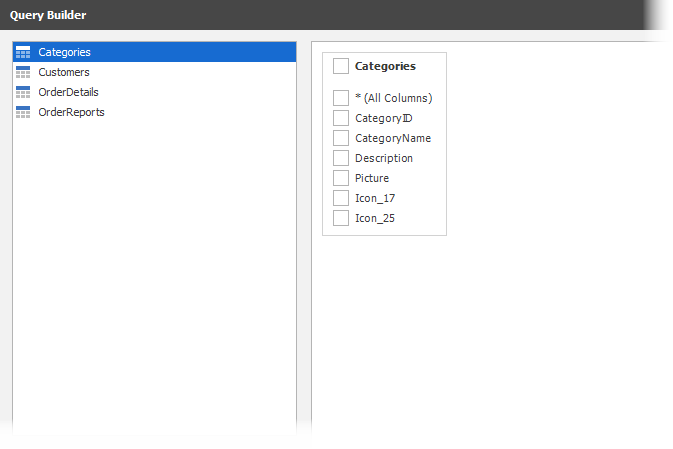
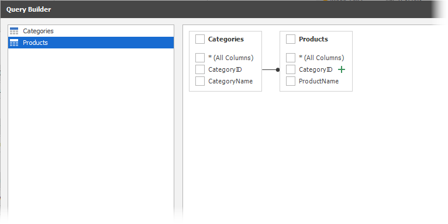

<!-- default badges list -->

<!-- default badges end -->

# Dashboard for WinForms - How to customize a database schema for SQL data sources

This example shows how to create a custom database schema for the dashboard. The example contains two implementation of the [IDBSchemaProviderEx](https://docs.devexpress.com/CoreLibraries/DevExpress.DataAccess.Sql.IDBSchemaProviderEx) interface, `LimitDBSchemaProvider` and `ManualDBSchemaProvider`. Use the [DashboardDesigner.CustomDBSchemaProviderEx](https://docs.devexpress.com/Dashboard/DevExpress.DashboardWeb.DevExpress.DashboardWin.DashboardDesigner.CustomDBSchemaProviderEx) property to specify a custom database schema provider for [SQL Data Sources](https://docs.devexpress.com/Dashboard/16151/winforms-dashboard/winforms-designer/create-dashboards-in-the-winforms-designer/providing-data/sql-data-source).

To see the result, add a new query or edit the existing query. The [Query Builder](https://docs.devexpress.com/Dashboard/117275) window contains only fields and tables that the custom database schema provider supplies.

### The LimitDBSchemaProvider class

File: [LimitDBSchemaProvider.cs](./CS/Dashboard_CustomSchemaProvider/LimitDBSchemaProvider.cs) (VB: [LimitDBSchemaProvider.vb](./VB/Dashboard_CustomSchemaProvider/LimitDBSchemaProvider.vb))

This provider displays only the following database entities:

- Tables which names start with the letter *C*
- Views which names start with *Order*
- Stored procedures with zero arguments

### The ManualDBSchemaProvider class

File: [ManualDBSchemaProvider.cs](./CS/Dashboard_CustomSchemaProvider/ManualDBSchemaProvider.cs) (VB: [ManualDBSchemaProvider.vb](./VB/Dashboard_CustomSchemaProvider/ManualDBSchemaProvider.vb))

This provider loads two tables (`Categories` and `Products`) for the nwind.mdb database connection.
. Both tables contain only two columns and the tables are linked by the `CategoryID` field.

This technique improves the [Data Source Wizard](https://docs.devexpress.com/Dashboard/17652/) performance when loading the database schema to the dashboard.

## Files to Review

* [LimitDBSchemaProvider.cs](./CS/Dashboard_CustomSchemaProvider/LimitDBSchemaProvider.cs) (VB: [LimitDBSchemaProvider.vb](./VB/Dashboard_CustomSchemaProvider/LimitDBSchemaProvider.vb))
* [ManualDBSchemaProvider.cs](./CS/Dashboard_CustomSchemaProvider/ManualDBSchemaProvider.cs) (VB: [ManualDBSchemaProvider.vb](./VB/Dashboard_CustomSchemaProvider/ManualDBSchemaProvider.vb))
* [Form1.cs](/CS/Dashboard_CustomSchemaProvider/Form1.cs) (VB: [Form1.vb](./VB/Dashboard_CustomSchemaProvider/Form1.vb))

## Documentation

* [Custom Database Schema](https://docs.devexpress.com/Dashboard/404087/winforms-dashboard/winforms-designer/create-dashboards-in-the-winforms-designer/providing-data/sql-data-source/custom-database-schema-provider?p=netframework) 

## More Examples

* [Dashboard for MVC - How to customize a data store schema for SQL data sources](https://github.com/DevExpress-Examples/aspnet-mvc-dashboard-how-to-customize-a-data-store-schema-for-sql-data-sources-t584271)
* [Dashboard for ASP.NET Core - How to customize a data store schema for SQL data sources](https://github.com/DevExpress-Examples/aspnet-mvc-dashboard-how-to-customize-a-data-store-schema-for-sql-data-sources-t584271)
